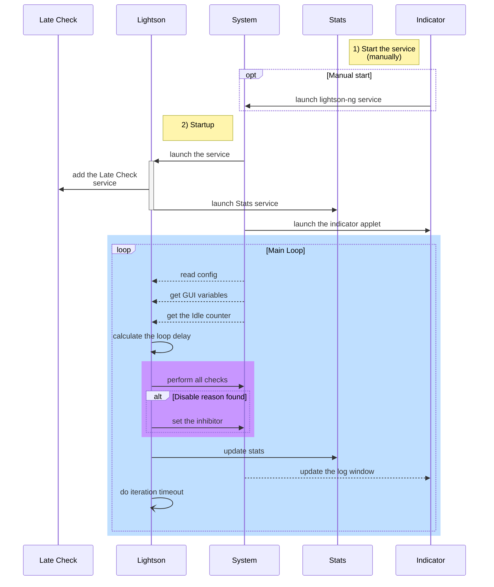
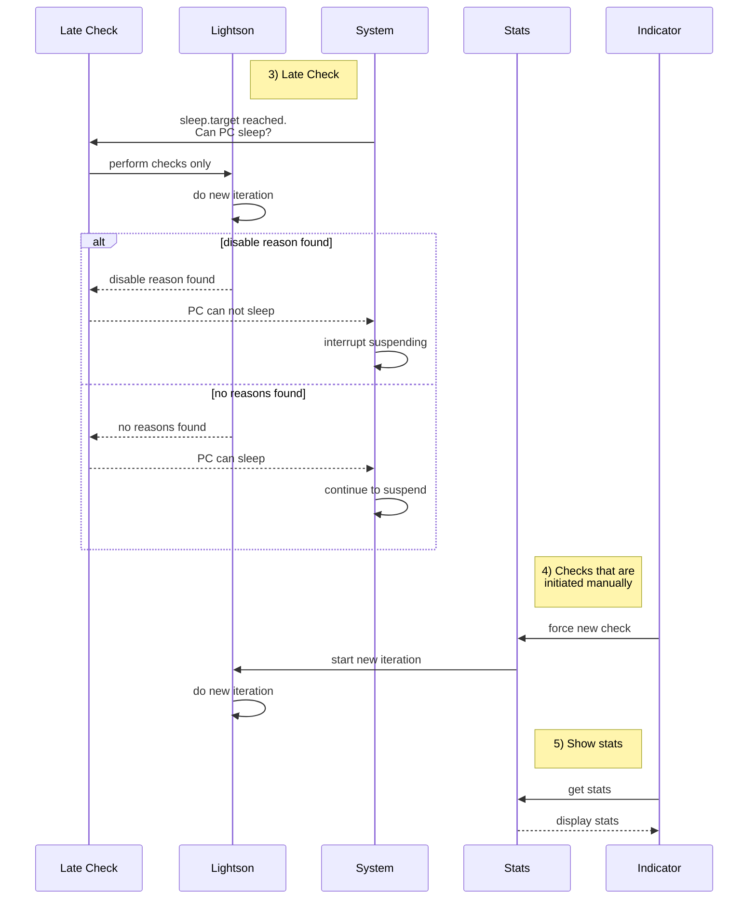

# Purpose
**lightson-ng** is a bash script that prevents Power Management idle/sleep modes and/or the screensaver and display power management (DPMS) from being activated by checking if system is performing specified actions, such as:  
- running specific programs, ex. Transmission, rsnapshot backup;
- while watching full-screen videos on Firefox, Chrome and Chromium. Media players like mplayer, VLC and minitube can also be detected;
- when MPRIS Media Player is playing. Example: YouTube will be detected when playing, since YouTube uses MPRIS in the back-end;
- when audio is playing via Pulse audio or via ALSA;
- when a CPU/Network load is high;
- when the network connection exists, ex. when PC acts as a home DLNA server and TV is playing movie from PC;
- when inhibit-file exists in /tmp/ directory;

If check provided a reason to prevent PM mode, script installs inhibitor(s) of idle/sleep modes.
>lightson-ng is designed for and works in the default Ubuntu 20.04 LTS: a desktop installation using Gnome 3. The other Linux distributions and desktop environments are not tested.
## Credits
The script uses the idea of lightsOn.sh script which was a great helper until Ubuntu had grown up and drastically modified its Power Management design, so the old lightsOn.sh stopped working completely, without leaving a chance that a small change in it will fix everything. In the modern systems, instead of delaying the screensaver, an **inhibitor is set** which inhibits the system to go into the idle/sleep mode. Considering these changed rules, current lightson-ng script was written from scratch reusing about 5% of the code from the original lightsOn.sh. lightson-ng is a **New Generation** of lightsOn and is working with Ubuntu 20.04 LTS. Note: lightson-ng preserved the screensaver delay functionality, but it is handled a bit differently, and generally is not a recommended way to go - use inhibitors instead.

Many thanks to author of the original lightsOn.sh (iye.cba) for the simple and brilliant script that worked for me many years, until I upgraded to the new Ubuntu. Also, I want to thank to contributors of lightsOn's forks who gave me many ideas in their code to implement them in the lightson-ng (such as dynamic loop delay).
# Table of contents
<div class="stackedit__toc">
  
<ul>
<li><a href="#purpose">Purpose</a>
<ul>
<li><a href="#credits">Credits</a></li>
</ul>
</li>
<li><a href="#example-use-cases">Example use cases</a></li>
<li><a href="#quick-start.">Quick start.</a></li>
<li><a href="#how-it-works">How it works</a>
<ul>
<li><a href="#architecture">Architecture</a></li>
<li><a href="#primary-operations">Primary operations</a></li>
<li><a href="#other-operations">Other operations</a></li>
</ul>
</li>
<li><a href="#installation">Installation</a></li>
<li><a href="#run">Run</a>
<ul>
<li><a href="#users-and-permissions">Users and permissions</a></li>
</ul>
</li>
<li><a href="#configuration">Configuration</a>
<ul>
<li><a href="#search-paths">Search paths</a></li>
<li><a href="#dynamic-config">Dynamic config</a></li>
</ul>
</li>
<li><a href="#checks-performed">Checks performed</a>
<ul>
<li><a href="#isfullscreenappplayingcheck">isFullscreenAppPlayingCheck</a></li>
<li><a href="#isaudioplayingcheck">isAudioPlayingCheck</a></li>
<li><a href="#isdelayprogrunningcheck">isDelayProgRunningCheck</a></li>
<li><a href="#iscpuloadhighcheck">isCpuLoadHighCheck</a></li>
<li><a href="#isnetworkloadhighcheck">isNetworkLoadHighCheck</a></li>
<li><a href="#isnetworkconnectionexistscheck">isNetworkConnectionExistsCheck</a></li>
<li><a href="#isinhibitfileexistcheck">isInhibitFileExistCheck</a></li>
<li><a href="#ismediaplayerplayingcheck">isMediaPlayerPlayingCheck</a></li>
<li><a href="#action-masks-of-checks">Action masks of checks</a></li>
</ul>
</li>
<li><a href="#logging">Logging</a></li>
<li><a href="#monitoring-with-indicator">Monitoring with Indicator</a>
<ul>
<li><a href="#status-icon-and-label">Status icon and label</a></li>
<li><a href="#force-check">Force check</a></li>
<li><a href="#show-stats">Show stats</a></li>
<li><a href="#show-logs">Show logs</a></li>
<li><a href="#startstop-service">Start/stop service</a></li>
</ul>
</li>
<li><a href="#troubleshooting">Troubleshooting</a>
<ul>
<li><a href="#turning-on-verbose-mode">Turning on verbose mode</a></li>
<li><a href="#turning-on-debug-mode">Turning on debug mode</a></li>
</ul>
</li>
<li><a href="#gui-availablenot-available">GUI available/not available</a></li>
<li><a href="#loop-control">Loop control</a></li>
<li><a href="#power-management-states-and-their-control">Power Management states and their control</a>
<ul>
<li><a href="#pm-states-enablingdisabling">PM states enabling/disabling</a></li>
<li><a href="#addingremoving-inhibitors-gnome-session-inhibit-systemd-inhibit">Adding/removing inhibitors: gnome-session-inhibit, systemd-inhibit</a></li>
<li><a href="#idlesleep-mode-counters">Idle/sleep mode counters</a></li>
<li><a href="#delaying-screensaver">Delaying screensaver</a></li>
<li><a href="#dpms-control">DPMS control</a></li>
</ul>
</li>
<li><a href="#late-check-service">Late check service</a></li>
<li><a href="#dbus-statistics-service">DBUS statistics service</a>
<ul>
<li><a href="#collecting-statistics-from-lightson-ng-setstats">Collecting statistics from lightson-ng: SetStats()</a></li>
<li><a href="#providing-statistics-to-indicator-getstats">Providing statistics to Indicator: GetStats()</a></li>
<li><a href="#setting-timer-for-loop-control-settimer">Setting timer for loop control: SetTimer()</a></li>
<li><a href="#check-connection-to-dbus-service-pingstats">Check connection to DBUS service: PingStats()</a></li>
<li><a href="#signals-and-corresponding-methods">Signals and corresponding methods</a></li>
</ul>
</li>
<li><a href="#creating-the-new-check">Creating the new check</a></li>
<li><a href="#creating-a-custom-pm-handler">Creating a custom PM handler</a></li>
<li><a href="#gdm-pm-settings-restore">GDM PM settings restore</a></li>
<li><a href="#design">Design</a>
<ul>
<li><a href="#integration-into-systemd">Integration into systemd</a></li>
<li><a href="#error-handling">Error handling</a></li>
<li><a href="#extending-pm-states">Extending PM states</a></li>
<li><a href="#pid-createremove">PID create/remove</a></li>
<li><a href="#parsing-arguments">Parsing arguments</a></li>
<li><a href="#screensaver-detection">Screensaver detection</a></li>
<li><a href="#readingwriting-gnome-settings">Reading/writing gnome settings</a></li>
<li><a href="#getting-gui-environment-variables.">Getting GUI environment variables.</a></li>
<li><a href="#executing-commands-with-sudo">Executing commands with sudo</a></li>
<li><a href="#other-packages-dependencies">Other packages dependencies</a></li>
</ul>
</li>
</ul>

</div>

# Example use cases
1. **Watching movies on TV without interruption**. Watching a movie on TV from PC that acts as NFS media server can be interrupted by PC's decision to go to sleep. Well, in a minute the connection is restored automatically by the WOL signal sent by the router, but this minute break is annoying. Lightson-ng is checking if the connection from TV exists, and if so - prevents sleep mode. After the movie is over, the TV is turned off (manually using the remote), thus dropping NFS connection and allowing PC to go to sleep.

2. **Guitar jamming with YouTube backtracks** requires PC to be turned on permanently to listen the backtrack, no screensaver/screen blanking is allowed to control the backtrack. To achieve this the lightson-ng is checking if the MPRIS media player is playing and, if so, prevents both idle and sleep modes.
# Quick start.
1. Download sources from github.
2. Unzip downloaded file.
3. Run the installation:
`sudo install-lightson`
This will:
	- install lightson-ng scripts to /usr/local/bin/ directory,
	- install the additional required packages from the Ubuntu repository,
	- create and launch lightson-ng service in systemd, enable the service at boot,
	- add the necessary permissions for DBUS service.
4. Launch the Indicator application for monitoring:
`lightson-ng-indicator.py`
A star icon in tray indicates that lightson-ng is installed and running OK.
# How it works
lightson-ng executes the infinite loop. Within the loop, checks are performed for events that need an idle/sleep modes to be prevented. If at least one reason is found to disable PM state, a new inhibitor is set. During all time the inhibitor is set, PC can not go to idle/sleep mode, the screensaver is not activated, the screen is not locked, the screen does not blank. If the inhibitor is already set on the previous iteration - it remains untouched. If all checks provide no single reason to disable PM state, the inhibitor removed. 
Lightson-ng consists of several processes: lightson-ng bash script, Stats DBUS service, Late Check systemd unit, lightson Indicator GUI. Processes communicate with each other using the DBUS signals.
## Architecture

## Primary operations

## Other operations

# Installation
The installation process is described in "Quick start". Below are just some details.
lightson-ng service is installed and run under the root account.
- Executables are copied to /usr/local/bin directory for convenient search via PATH variable:
	- lightson-ng bash script
	- lightson-ng-stat.py python script
	- lightson-ng-indicator.py python script
Also, execute permissions are added to these scripts.
- lightson-ng.service file contains the necessary information to run lightson-ng as a service under control of systemd. Service file is copied to /lib/systemd/system directory. Installation script runs systemctl commands to enable the service at boot time. Also, installation script starts the service itself.
- lightson-ng-stat.conf file contains a list of permissions required to use the Stats DBUS service. This file is copied to /etc/dbus-1/system.d/ directory. The installation script reloads dbus configuration to apply permissions.
- The following Ubuntu packages are installed:
	- net-tools - contains `netstat` command which is used by network connection check.
	- sysstat - contains `sar` command which is used by network load check.
	- gir1.2-appindicator3-0.1 - contains Appindicator3 python API used by lightson-ng-indicator.py script.
	- gnome-icon-theme - contains icons used by lightson-ng-indicator.py.
- lightson-ng-indicator.py is a user-space monitoring tool that can be manually added to auto-launch of X session login. Either use `Startup Applications` or execute the following commands:
	```
	cp lightson-ng-indicator.desktop $HOME/.local/share/applications/
	ln -sf $HOME/.local/share/applications/lightson-ng-indicator.desktop $HOME/.config/autostart/
	```
- Late Check service does not require installation, since it is runtime service that is created by lightson-ng script when lightson-ng service is launched.
# Run
- lightson-ng service is started automatically by systemd
- lightson-ng-indicator.py either can be started manually from a terminal:
`user@host:~$lightson-ng-indicator.py`
or can be started automatically from auto-launch (see "Installation" chapter).
## Users and permissions
lightson-ng script should be executed under **root** account.
It is possible to run lightson-ng under non-root account, but Late Check service will not start in this case. DBUS statistics service will start, a Session bus will be used instead of System bus. Thus, service will be accessible to one user only, instead of being system-wide. The indicator will run as well, showing the current status by setting corresponding icon, the label will display "ERR" indicating that the back-end is running in wrong mode. So, this mode is not recommended, while possible.
# Configuration
Configuration of lightson-ng is done directly in bash code, but in a separate config-files (see "Config-files" section below). It is possible, but not recommended to edit the lightson-ng script itself. Configurable variables are marked in the script by "Below are configurable variables" row.
Each variable has a comment explaining its meaning.
The following can be configured:
- turn on/off particular checks
- provide the additional information to perform checks, such as network load threshold, a list of programs which require PC to be turned on, a list of remote IP addresses for connection check, etc.
- logging/debugging options
- loop control
- misc flags to turn on/off the particular functionality

>Flags are set to True by setting the value to 1, to False by setting the value to 0

Changing variables after the line "Below are non configurable variables" is forbidden, and usually makes no sense, since most of them are changed during runtime.
## Search paths
Config-files are searched in the following order:
1. $HOME/.config/lightson-ng/lightson-ng.conf
2. /etc/lightson-ng.conf
3. {directory where lightson-ng script is located}/lightson-ng.conf

When the first config file is found, the search stops.
> /etc is the recommended location of config-file.

Arguments passed via command line take precedence over conf-file unless dynamic config is opted. Dynamic config takes precedence over all other configurations.

## Dynamic config
If dynamicConfig is set to 1, then the config file is loaded at start of every iteration. It is useful when debugging without the need to restart script.
If dynamicConfig is set to 0, then the config file is loaded at start of lightson-ng script only.
# Checks performed
Every check can be skipped by setting its corresponding flag to 0. The following naming convention is used:
- for flag: detect{check_name}
- for check: is{check_name}Check
## isFullscreenAppPlayingCheck
Check if a full-screen video/audio is playing in Firefox/Chrome/Chromium.
## isAudioPlayingCheck
Check if any application is playing sounds via Pulse Audio or via ALSA.
Configuration:
- detectAudioPlaying - flag to execute the check
- alsaCardStatus - ALSA sound card where detect sound on. Example value: `"/proc/asound/card0/pcm0p/sub0/status"`
- detectPlayingViaAlsa - flag to detect playing sound via ALSA
- detectPlayingViaPulse - flag to detect playing sound via Pulse Audio
> Note: JACKD when running turns ALSA into permanently "RUNNING" state. Therefore, check always returns True. Either flag this check off when using JACKD, or use a different sound card for JACKD.
## isDelayProgRunningCheck
Check if specific programs are running.
- delayProg - names of programs which, when running, you wish to disable idle/sleep modes. Example value: `('transmission-gtk')`
## isCpuLoadHighCheck
Check if CPU load is high using `uptime` command.
Load average for the past 5 minutes is taken.
- cpuLoadMax - max CPU load average.  Note: load average is not normalized for the number of CPUs in a system,  so a load average of 1 means a single CPU system is loaded all the time  while on a 4 CPU system it means it was idle 75% of the time. Example value: `2`
## isNetworkLoadHighCheck
Check if network load is high using `sar` command.
- ifUsageMax - Max usage of network interface for NetworkLoadHigh check.  In percents of possible utilization of given interface.  Usually, limit of 0.1 is more than YouTube may utilize on 1GBit network card. Example value: `"0.1"`
## isNetworkConnectionExistsCheck
Check of network connections made to this PC.
Connections can be of any protocol and type: NFS/DLNA/SMB...TCP/UDP/...  Using sockets is also OK, but it will be named as "ip" in the log file - a minor drawback.
- remoteIpList - a list of remote PCs/devices connected to this PC. When they are connected - lights should be On. Example value: `('1.1.1.1' '2.2.2.2')`

## isInhibitFileExistCheck
Check if inhibit-file exists.
Inhibit file is set externally: either manually or by some program. Example use:
`touch /tmp/lightson-ng-inhibit-0-`

## isMediaPlayerPlayingCheck
Check if MPRIS Media Player is playing something.
Can be used to check if Chrome is playing YouTube video. Use of Media Player is not limited to the Chrome only, but extends to Totem, Audacious, etc.
## Action masks of checks
Every check may have one or more actions assigned to it:
- ACTION_MASK["idle"] - prevent Idle mode when check returns True
- ACTION_MASK["sleep"] - prevent Sleep mode when check returns True
- GUI_REQUIRED_MASK - a GUI is required to perform this check successfully. Perhaps this flag is redundant, since ACTION_MASK["idle"] anyway requires GUI to operate.
# Logging
Logging is done into /var/log/syslog using specified --tag and --id, thus making lightson's messages distinguishable among others. The following types of log messages are possible:
- a regular log message. Issued if logSyslog is turned on.
- error message. Issued when error occurs.
- debug message. Issued when debug mode is turned on (debugMode).

> Having logSyslog always turned on for regular messages is recommended.

If logStdout is turned on, then messages are printed to screen. Primarily used for debugging/troubleshooting.
# Monitoring with Indicator
Monitoring of lightson-ng is simplified with lightson-ng-indicator.py.
Indicator mainly provides a status of lightson-ng service, also it is possible to execute an unscheduled check, start/stop the lightson-ng service, read logs for troubleshooting.
## Status icon and label
Current lightson's status is shown in the Indicator's icon:
- non-starred icon - if no disable reasons found
- starred icon - if disable reasons were found for all PM states.
- semi-starred icon - if a disable reason is found for one state, but not found for another
- dialog-warning icon - if a reason was not parsed correctly. Mostly it indicates an error in the lightson-ng service.
- dialog-error icon - if Indicator itself encountered an error.

A text label is set on the right of the icon. The label provides more detailed status information. It displays "X" in the label if disable reason found. First character corresponds to the Idle reason, second - to the Sleep reason. "ERR" - means: the error occurred in lightson-ng service.
## Force check
Ask the lightson-ng to perform checks. Status icon and label are updated with the result of the checks performed.
## Show stats
Display the window with the lightson-ng statistics.
## Show logs
Display last logs of lightson-ng process itself and its dbus service in the new window.
## Start/stop service
Start/stop the lightson-ng service manually.  
> normally the service should be started by systemd at boot.
# Troubleshooting
When something does not work as expected, stop lightson-ng service:
`sudo service lighton-ng stop`
and execute lightson-ng script manually:
`sudo lightson-ng --verbose --debug-on`
check logs:
`cat /var/log/syslog | grep lightson`

If needed, execute the indicator manually:
`lightson-ng-indicator.py --verbose`
## Turning on verbose mode
Verbose mode is turned on to display messages on screen. It is turned on by -v or --verbose command-line option for lightson-ng and lightson-ng-indicator.py programs.
## Turning on debug mode
Debug mode provides much more information than regular mode. All debug messages are shown. Debug mode is turned on by -b or --debug-on option for lightson-ng and lightson-ng-indicator.py programs.
Debug mode for lightson-ng also can be turned by option debugMode in config-file.

# GUI available/not available
Right after the boot, when no user is logged into X session, there is no X session started, obviously. It means that Idle mode is not available, no screensaver can be started, no processes having DISPLAY variable defined. PC can not go idle, but can go into the sleep mode. In terms of lightson-ng it means "GUI is not available". In this mode lightson-ng can perform checks that do not require GUI and can inhibit sleep mode.
When a user is logged into X session, there are processes created having DISPLAY variable defined, GUI becomes available. Also, the idle counter becomes available, correspondingly PC can go idle. When lightson-ng detects availability of GUI, it "steals" environment variables from the active GUI session and then uses these variables to perform GUI-dependent checks and inhibits of the idle mode. Particularly, environment variables are taken from the `gnome-session-binary` process. Besides, a username who is running X session becomes known.
GUI availability is checked by lightson on every iteration, so when X session is finished or another user is logged in - lightson-ng knows about it.
# Loop control
After every iteration, when all checks are performed and inhibitors are set, lightson-ng sleeps and waits to start a new iteration. This waiting time is very important for the entire process: in one hand the sleep delay should not be too short to save CPU resources, in other hand lightson-ng should not miss the moment when the PC goes to the idle or sleep mode.
The simplest (but not the smartest) way is to set a fixed, **static** value of loopDelay variable, let's say 60 seconds. If a system has an idle timeout configured for 10 minutes, then chances are high that lightson-ng can set the inhibitor before the idle mode activates.
A better (but still not the ideal) way is to use **Dynamic Loop Delay**: dynamicLoopDelay=1. In this case the delay is calculated automatically: an idle or sleep timeout (whichever is smaller) is taken as the base of calculations. The current value of idle counter is taken from the system and subtracted from timeout. The resulting value is how much time left before the system will go idle. Some small amount of "spare" time is subtracted even more, to let the lightson-ng perform checks before timeout occurs. Thus next lightson's iteration is "precisely" placed in the timeline, exactly before the idle timeout happens.

Loop delay can be either done by "**sleep**" command, or by setting a **timer** in DBUS Stats service. In latter case lightson can be controlled by lightson-ng-indicator via DBUS and the Late Check service can work properly because the delay is interrupted by signals:
- FinishLoopDelaySignal - when the timer is over.
- DoLateCheckIterationSignal - when Late Check service is executed and is asking lightson-ng to perform checks.
# Power Management states and their control
## PM states enabling/disabling
When lightson's checks showed that PC can not go to idle or sleep mode, a corresponding Power Management state should be disabled. It is done by setting the inhibitor for the period when the state should be disabled. As soon as checks show that the state can be enabled again, an inhibitor is removed.
## Adding/removing inhibitors: gnome-session-inhibit, systemd-inhibit
Adding inhibitor is done by executing one of the following system tools:
- gnome-session-inhibit - used when GUI is available. Inhibitor is set on behalf of GUI user.
- systemd-inhibit - used when GUI is not available. Inhibitor is set from the root user.
Inhibitor calls `sleep infinite` process to have inhibitor set as long as needed.

Removing inhibitor is a simple `kill` command issued to kill the `sleep infinite` process.
## Idle/sleep mode counters
An idle counter is how much time is left before timeout. The counter is reset every time when the user activity happens, i.e keypress or mouse move. The current value of Gnome's idle counter is taken from org.gnome.Mutter.IdleMonitor.GetIdletime DBUS interface.
>Idle counters for other than Gnome environment are not supported by lightson-ng.

There is no sleep mode counter found in Ubuntu. Perhaps it even does not exist, then it is a question how sleep mode timeout is reached?
## Delaying screensaver
Delaying screensaver is an "old-school" method to prevent the idle mode. Delaying is done by simulating user activity using `xdotool`
lightson-ng can execute screensaver delay instead of setting inhibitor, when forceDelayScreensaver is opted. See also accompanying option forceDelayDpms to delay DPMS together with delaying the screensaver.
In general, delaying the screensaver is a less preferable option over setting the inhibitor, due to unpredictable timings.
## DPMS control
Unfortunately inhibitors do not control DPMS. Therefore DPMS disable/enable is performed as an additional step when disabling/enabling idle state.
>DPMS control is not used for sleep state control.
# Late check service
When using a dynamic loop delay, chances that lighton-ng will miss unwanted sleep state are very low, but still they are. The Late Check service does the job to prevent the sleep mode for sure. It is added as a runtime systemd service into the chain between the sleep.target and the actual call to suspend the system. Issues DBUS signal "DoLateCheckSignal" asking lightson-ng for performing checks. lightson-ng performs checks only (no inhibitors are set/removed) and returns the result in the form of signals EnableReasonsleepSignal and DisableReasonsleepSignal.
A drawback of using Late Check is a strange behavior in system logs. At least, some processes (namely DBUS-controlled, such as Network Manager) are already ready to sleep before the sleep.target is reached. It should not be so, but it is, so that the behavior of the absolutely correct system's is not expected.

Generally, the use of Late Check should be avoided as much as possible, and, thanks to the dynamic loop delay, it is. Late Check will surely work when the "Suspend" button is pressed. Therefore, if the PC does not go to sleep from the keyboard - check if lightson-ng did not set any inhibitors, shutdown the lightson-ng service if necessary.

# DBUS statistics service
Since bash can not create DBUS service, a python helper script is developed: lightson-ng-stat.py
The script is called directly from lightson-ng and installs DBUS service "org.LightsOn.StatService".
The service has one interface, "org.LightsOn.StatInterface" that proposes one object "/LightsOnStat".
The service collects statistics from lightson-ng service to pass it to lightson-ng-indicator GUI upon request from it.
Also, service controls dynamic loop delay of lightson-ng.
Signals are generated by statistics service. All clients are only signal recipients. If there is a need to generate a signal, a corresponding method is called.

## Collecting statistics from lightson-ng: SetStats()
Get one statistic per call from lightson-ng process  and store it in the corresponding array.
The following statistics are collected:
- Enable/disable reasons
- Checks performed
- Config file name
- GUI user
- PID of idle/sleep inhibitor
- Inhibitor type (gnome/systemd)
- Inhibitor user
- Path to lightson-ng script
- PID of lightson-ng script
- User lightson-ng script is running under.
- Loop delay (in seconds)
- Number of runtime errors
## Providing statistics to Indicator: GetStats()
Return the dictionary with statistics collected by lightson-ng.  This method is called by lightson-ng-indicator.
## Setting timer for loop control: SetTimer()
Asynchronous timer. Used by lightson-ng to delay between iterations.
## Check connection to DBUS service: PingStats()
Returns "Hello" string if connection is OK.
## Signals and corresponding methods
- IterationFinished() - IterationFinishedSignal - Informational signal: lightson-ng just finished the iteration.
- ForceNewIteration() - FinishLoopDelaySignal - Emit a signal to break the delay and loop over new iteration.
- DoLateCheckIteration() - DoLateCheckSignal - Emit a signal to break the delay and loop over the new iteration specifically for Late Check service.
- DisableReasonFound,() - DisableReasonidleSignal DisableReasonsleepSignal - Informational signal: lightson have found a reason to disable PM state.
- EnableReasonFound() - EnableReasonidleSignal, EnableReasonsleepSignal - Informational signal: lightson have not found a reason to disable PM state.
# Creating the new check
It is possible add the new custom checks, on top of the existing. See example lightson-ng.conf for details where isMyTestCheck() explained in comments.
# Creating a custom PM handler
An action handler can be overwritten in config file. It is very unlikely to be needed by someone, but just in case...
# GDM PM settings restore
It is possible to recover PM settings in gnome, if something is broken in Power Management settings of GDM user (one that is used when no user is logged in).

# Design


## Integration into systemd
Systemd proposes the very convenient way to create and run a service. In order to be controlled by systemd, properly located in the service startup chain, the service needs to be configured as a unit.
- **`lightson-ng.service`** - is a permanent systemd's unit. Service launches the lightson-ng script after the network becomes available. A minimal environment is set for this unit. The environment is required by the script to find an external utility such as `sar`,  `awk`, etc. A home directory is also set to find the config-file there, if any. The script is stopped by a simple `kill` command. The service is started automatically every boot for multi-user.target. The service can be operated as any other systemd service:
`systemctl disable lightson-ng` - disable service in systemd, so it will not start at boot
`systemctl enable lightson-ng` - enable the service in systemd, so it will start at boot
`service lightson-ng start` - start the service manually
`service lightson-ng stop` - stop the service
`service lightson-ng status` - check status of the service. Example of status with the sleep inhibitor set:
```
● lightson-ng.service - lightson-ng service - prevent sleep and screen lock
     Loaded: loaded (/etc/systemd/system/lightson-ng.service; enabled; vendor preset: enabled)
     Active: active (running) since Sun 2022-02-13 01:58:39 EET; 6s ago
   Main PID: 126697 (bash)
      Tasks: 15 (limit: 28700)
     Memory: 16.6M
     CGroup: /system.slice/lightson-ng.service
             ├─126697 bash /usr/local/bin/lightson-ng --quiet
             ├─126810 python3 /usr/local/bin/lightson-ng-stat.py --quiet --no-syslog
             ├─126949 bash /usr/local/bin/lightson-ng --quiet
             ├─126951 sudo --user myuser bash -c set -a; source /tmp/tmp.zIUOzFv2onlightson-ng; gnome-session-inhibit --inhibit suspend --reason lightson-ng --app-id lightson-ng s>
             ├─126952 bash -c set -a; source /tmp/tmp.zIUOzFv2onlightson-ng; gnome-session-inhibit --inhibit suspend --reason lightson-ng --app-id lightson-ng sleep infinity
             ├─126953 gnome-session-inhibit --inhibit suspend --reason lightson-ng --app-id lightson-ng sleep infinity
             ├─126957 sleep infinity
             ├─127018 bash /usr/local/bin/lightson-ng --quiet
             └─127019 dbus-monitor --system type='signal',interface='org.LightsOn.StatInterface'

Feb 13 01:58:43 myhost sudo[126931]: pam_unix(sudo:session): session closed for user myuser
Feb 13 01:58:43 myhost sudo[126936]:     root : TTY=unknown ; PWD=/ ; USER=myuser ; COMMAND=/usr/bin/bash -c set -a; source /tmp/tmp.zIUOzFv2onlightson-ng; pacmd list-sink-inputs
Feb 13 01:58:43 myhost sudo[126936]: pam_unix(sudo:session): session opened for user myuser by (uid=0)
Feb 13 01:58:43 myhost sudo[126936]: pam_unix(sudo:session): session closed for user myuser
Feb 13 01:58:43 myhost lightson-ng[126697]: a program from delay list [transmission-gtk] is running
Feb 13 01:58:43 myhost lightson-ng[126697]: Disabling sleep state because a program from delay list [transmission-gtk] is running
Feb 13 01:58:43 myhost sudo[126951]:     root : TTY=unknown ; PWD=/ ; USER=myuser ; COMMAND=/usr/bin/bash -c set -a; source /tmp/tmp.zIUOzFv2onlightson-ng; gnome-session-inhibit >
Feb 13 01:58:43 myhost sudo[126951]: pam_unix(sudo:session): session opened for user myuser by (uid=0)
Feb 13 01:58:44 myhost lightson-ng[126697]: sleep inhibitor [126957] of type gnome is added
Feb 13 01:58:44 myhost lightson-ng[126697]: Sleeping and waiting for signal from DBUS.

```

- The **Late Check service** - is created as a runtime systemd unit and started from the lightson-ng script itself. The service lives while lightson-ng script is running. As soon as lightson-ng is stopped - the Late Check service is removed from the systemd and can not interfere with the systemd's suspend chain. The service is a one-time service executed when the sleep.target is reached, but before the suspend. If the service do not receive a reply from lightson-ng within 20 seconds, it is stopped passing control back to the systemd.
- **Stats service** - is launched by lightson-ng script. No systemd unit is created, but only DBUS permissions configuration file is added: `lightson-ng-stat.conf`. Stats service lives while lightson-ng script is running, similar to the Late Check service. Note: permissions are installed permanently, there is no (easy) way to set them runtime.

When running, units do not output messages to the screen, but instead to syslog. Anyway, if unit accidentally sends some message to the screen, systemd will route it to the syslog (duplicate messages may occur!).


## Error handling
There is a relatively strict error handling is used in the lightson-ng bash script: almost every error is caught and displayed in the log with prefix "ERROR: ". The script stops execution when severe error occurs, continues when negligible errors occur.

Some more relaxed error handling is set for lightson-ng-indicator.py, relying on Python exceptions.
## Extending PM states
Currently, two Power Management states are controlled by lightson-ng: "idle" and "sleep".  If needed, states can be extended to more, such as "shutdown", "reboot", etc. by adding extra states to variables powerManagementStateList, previousStateDisabled, disableReason and with minor changes in the code.
## PID create/remove
The only one instance of lightson-ng can run simultaneously. That's why lightson-ng creates the PID-file at startup and checks if no other instance is running.
When removing PID-file at the end of execution (i.e. when service is stopped), some "cleanup" actions are performed also:
- the Late Check service is removed from systemd
- Power Management states are restored to their original states: all inhibitors set by lightson-ng are removed.
- Stats DBUS module is killed
- GUI environment file is removed
## Parsing arguments
Some frequently used configuration options can be set via command line. Mostly, there are logging/debugging options.
| Option | Description |
|--|--|
| -d,  --delay \<time in minutes>  | Time interval between checks. Default: 1 min |
| -c,  --config-file \<filename> |  Use configuration from file |
| -q,  --quiet  | Do not print messages on screen, but to log file only |
| -v,  --verbose  | Print messages on screen |
| -g   --no-syslog | Do not print messages to syslog |
| -s   --syslog | Print messages to syslog |
| -b   --debug-on | Print debug messages |
| -n   --debug-off  | Do not print debug messages |
| --chrome-app \<app name> | Fullscreen Chrome app detection |
| --window-name \<window name>  | Detect fullscreen app by window name |
| --restore-pm-settings  | Restore default Power Management settings for this PC |

## Screensaver detection
Screensaver detection is used when the use of inhibitors is impossible for some reason. A several types of screensavers can be detected and correspondingly delayed. To delay the screensaver (and to reset the idle counter), the user activity is simulated, mostly by simulating the mouse movement via `xdotool`. When delaying the screensaver, DPMS is delayed also, with bouncing DPMS "off" and then "on".
## Reading/writing gnome settings
lightson-ng uses some settings stored in Gnome, such as idle-delay, sleep-inactive-ac-timeout, sleep-inactive-battery-timeout to adjust the loop delay. Also, gnome settings are used to restore the default PM settings in GDM schema.
## Getting GUI environment variables.
Lightson-ng is running as a systemd service, not in graphical terminal, having variables such as DISPLAY, DBUS_ADDRESS undefined. While GUI environment variables are needed when installing the gnome-inhibitor, when performing some GUI-dependent checks, when simulating user activity, etc.
Variables are taken from the active GUI (x11) session. If in such session the `gnome-session-binary` process is running, then the session is considered as having a proper GUI variables.

> GUI variables may not be available right after the boot, when no user is logged into X session.
## Executing commands with sudo
GUI-dependent checks are executed under the account of the user who's GUI session is active now.  GUI username and GUI environment variables collected previously are used to run sudo commands.
If no GUI variables were collected, the command is executed as user who is running lightson-ng (usually `root`)
## Other packages dependencies
Ubuntu packages needed for lightson-ng functioning are described in the Installation section.

> Written with [StackEdit](https://stackedit.io/).
